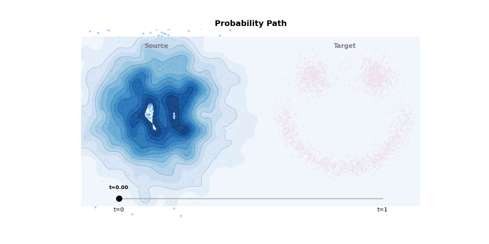

# Flow Visualizer

A simplified implementation of Flow Matching for visualizing how generative models transform Gaussian noise into structured data distributions.




## Usage

Train the model:

```bash
uv run fv-train
```

Generate visualizations:

```bash
uv run fv-visualize
```

## References

- [Flow Matching for Generative Modeling](https://arxiv.org/abs/2210.02747)
- [Rectified Flow Blog](https://alechelbling.com/blog/rectified-flow/)
