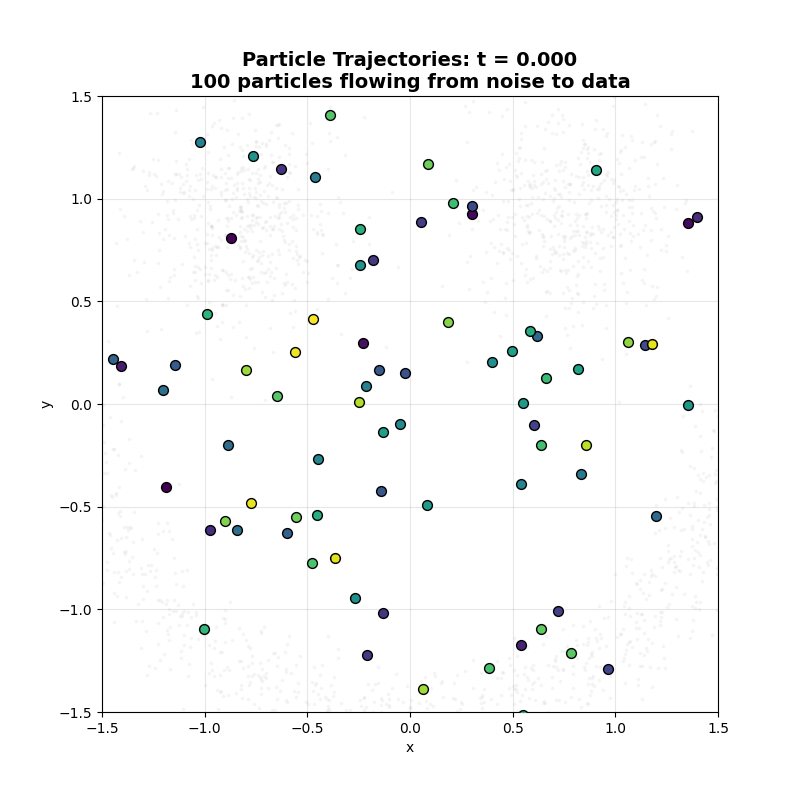

# Flow Visualizer

A simplified implementation of diffusion model training and visualization using Flow Matching on 2D datasets.

This project is inspired by [Diffusion-Explorer](https://github.com/helblazer811/Diffusion-Explorer) and provides an educational tool for understanding how diffusion models transform Gaussian noise into structured data distributions.

## Gallery

Watch how Flow Matching transforms Gaussian noise into a T-Rex! 🦖

### Flow Animation
The entire distribution evolving from random noise to the T-Rex shape:


### Particle Trajectories
Individual particles flowing through the learned velocity field:



### Density Evolution
Probability density heatmap showing how the distribution transforms:


### Vector Field Animation
The distribution flowing along the learned velocity field:


## Features

- **Flow Matching**: Implements continuous normalizing flows for generative modeling
- **T-Rex Dataset**: Generates a 2D T-Rex shaped point cloud for fun visualization
- **Fast Training**: Optimized learning rate (0.003) for quick convergence in ~300 epochs
- **Interactive Training**: Train models with Hydra configuration management
- **Rich Visualizations**:
  - Static plots showing trajectory evolution, comparisons, and vector fields
  - **Animated GIFs** showing the flow from Gaussian noise to data distribution:
    - **Flow animation**: Watch the entire distribution transform over time
    - **Particle trajectories**: Track individual particles flowing from noise to structure
    - **Density evolution**: Heatmap visualization of probability density changes
    - **Vector field animation**: See the learned velocity field guide the flow

## Installation

This project uses [uv](https://github.com/astral-sh/uv) for fast Python package management.

```bash
# Clone the repository
git clone <your-repo-url>
cd flow-visualizer

# Dependencies are already configured - uv will handle them automatically
```

## Usage

### Quick Start

Train the model:

```bash
uv run fv-train
```

Generate visualizations (after training):

```bash
uv run fv-visualize
```

Or use the main CLI:

```bash
uv run flow-visualizer train
uv run flow-visualizer visualize
uv run flow-visualizer all  # Train and visualize
```

### Configuration

All settings are managed through Hydra. Override any configuration value from the command line:

```bash
# Train for more epochs
uv run fv-train training.n_epochs=500

# Adjust learning rate
uv run fv-train training.learning_rate=0.005

# Change dataset noise level
uv run fv-train data.noise=0.05

# Adjust model architecture
uv run fv-train model.hidden_dims=[256,512,512,256]

# Combine multiple overrides
uv run fv-train training.n_epochs=500 training.learning_rate=0.005 training.batch_size=512
```

### Configuration Options

Key configuration parameters in `conf/config.yaml`:

**Data**:
- `data.n_samples`: Number of training samples (default: 10000)
- `data.noise`: Gaussian noise level (default: 0.02)

**Model**:
- `model.data_dim`: Data dimensionality (default: 2)
- `model.time_embed_dim`: Time embedding dimension (default: 64)
- `model.hidden_dims`: MLP hidden layer sizes (default: [128, 256, 256, 128])

**Training**:
- `training.n_epochs`: Number of training epochs (default: 300)
- `training.batch_size`: Batch size (default: 256)
- `training.learning_rate`: Learning rate (default: 0.003)
- `training.device`: Device to use (default: cpu, or cuda if available)
- `training.log_interval`: Logging frequency in epochs (default: 50)

**Visualization**:
- `visualization.n_sampling_steps`: Number of sampling steps (default: 100)
- `visualization.grid_size`: Vector field grid resolution (default: 20)
- `visualization.animation_fps`: Frames per second for GIF animations (default: 20)
- `visualization.animation_dpi`: DPI for GIF output quality (default: 100)
- `visualization.animation_subsample`: Use every Nth frame to reduce file size (default: 1)
- `visualization.n_particles`: Number of particle trajectories to visualize (default: 100)
- `visualization.trail_length`: Length of particle trails in frames (default: 10)
- `visualization.density_grid_size`: Resolution for density heatmap (default: 100)

## Output

After running training and visualization, you'll find:

- **Models**: `outputs/models/velocity_net.pt` - Trained model weights
- **Static Visualizations**:
  - `outputs/visualizations/comparison.png` - Target vs Generated comparison
  - `outputs/visualizations/trajectory.png` - Sampling trajectory evolution
  - `outputs/visualizations/vector_field.png` - Learned velocity fields
- **Animated GIFs** (the cool part! 🎬):
  - `outputs/visualizations/flow_animation.gif` - Full distribution flowing from Gaussian to T-Rex
  - `outputs/visualizations/particle_trajectories.gif` - Individual particles with trails showing their paths
  - `outputs/visualizations/density_animation.gif` - Heatmap showing probability density evolution
  - `outputs/visualizations/vector_field_animation.gif` - Distribution flow with velocity field overlay

## How It Works

### Flow Matching

Flow Matching learns a velocity field that transforms samples from a simple distribution (Gaussian noise) to a complex target distribution (spiral dataset). The model:

1. **Training**: Learns to predict velocities between noise and data points
2. **Sampling**: Integrates the learned velocity field using Euler method to generate new samples

### Architecture

- **Velocity Network**: MLP with time embedding that predicts velocity vectors
- **Loss**: Mean squared error between predicted and target velocities
- **Integration**: Euler method for ODE solving during sampling

## Project Structure

```
flow-visualizer/
├── conf/
│   └── config.yaml          # Hydra configuration
├── src/
│   └── flow_visualizer/
│       ├── __init__.py
│       ├── data.py          # Dataset generation
│       ├── model.py         # Flow Matching model
│       ├── train.py         # Training script
│       └── visualize.py     # Visualization script
├── main.py                  # CLI entry point
├── pyproject.toml          # Project metadata and dependencies
└── README.md
```

## Requirements

- Python >= 3.11
- PyTorch
- Hydra-core
- Matplotlib, NumPy, SciPy, tqdm

All dependencies are managed by uv and specified in `pyproject.toml`.

## References

- [Diffusion-Explorer](https://github.com/helblazer811/Diffusion-Explorer) - Original interactive web-based tool
- [Flow Matching for Generative Modeling](https://arxiv.org/abs/2210.02747)
- [Hydra Configuration Framework](https://hydra.cc/)
- [uv Package Manager](https://github.com/astral-sh/uv)

## License

MIT
